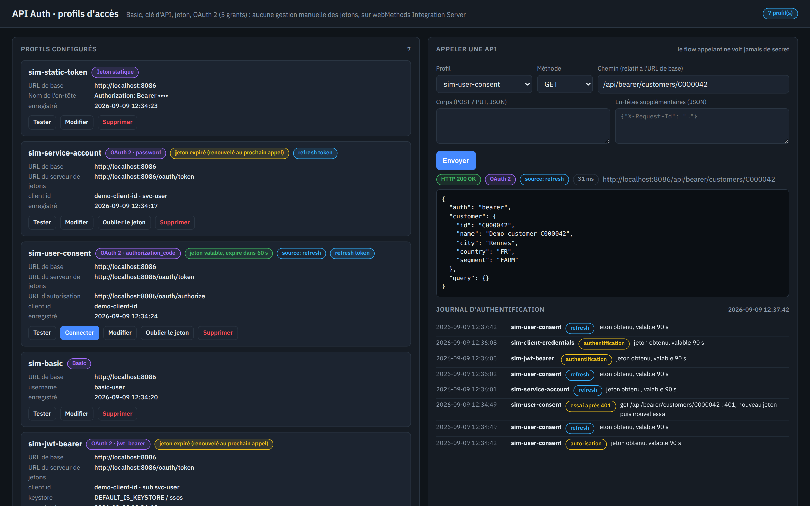
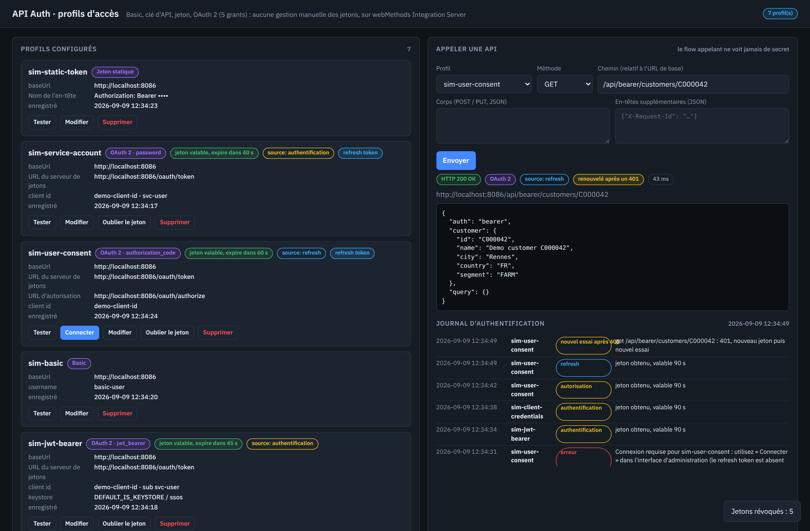
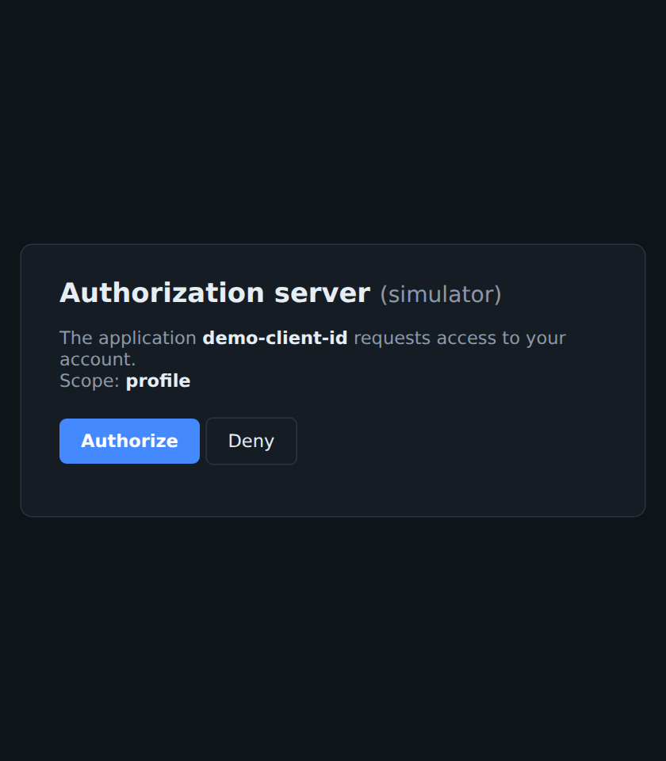
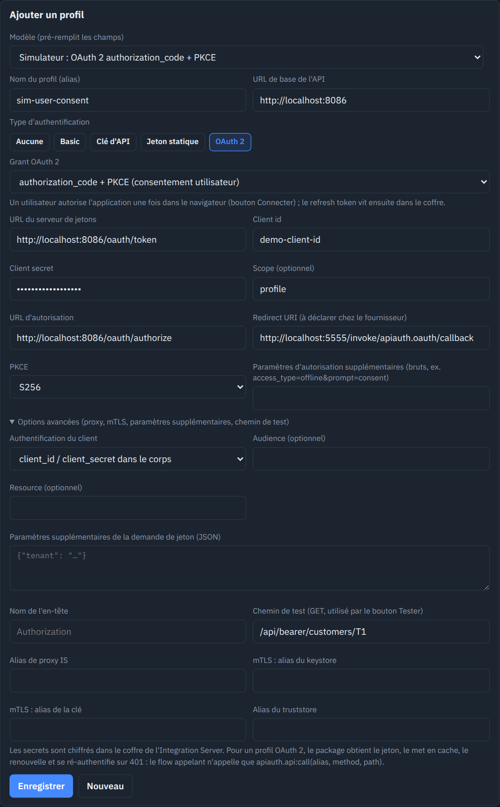
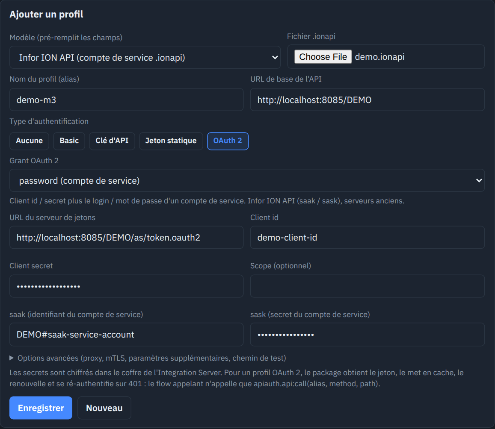
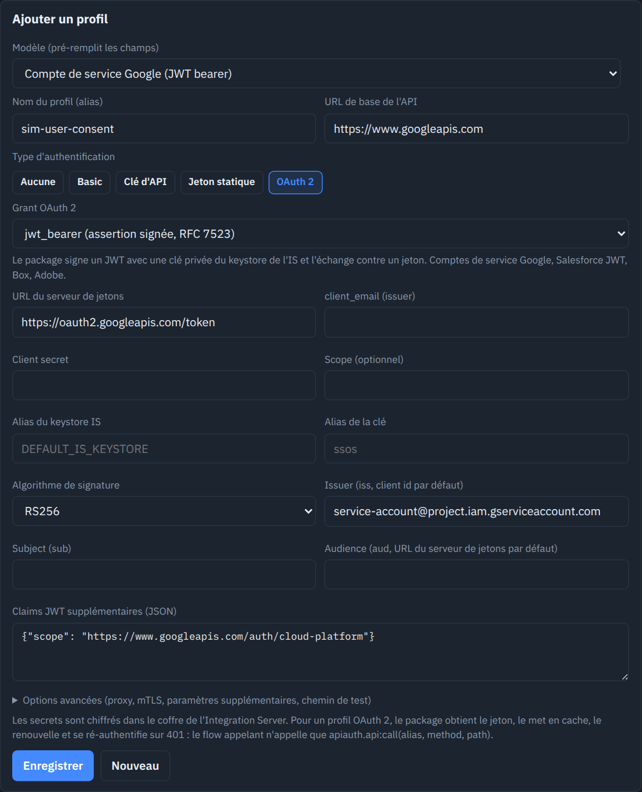
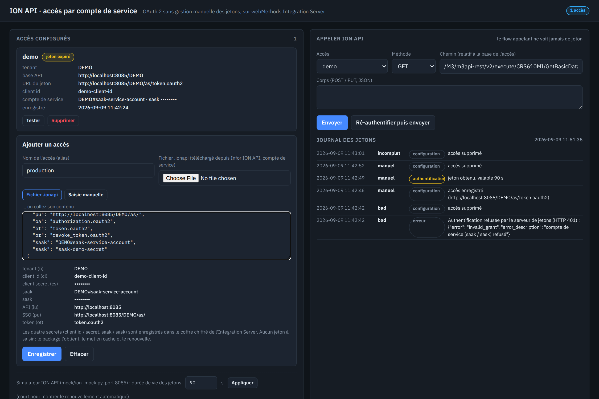
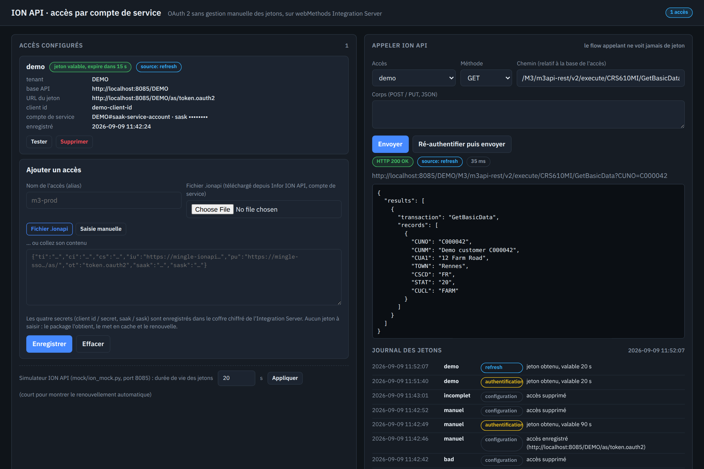

# Authentification d'API sans gestion manuelle des jetons, sur webMethods Integration Server

Deux packages Integration Server 12.1, construits par flow services (putNode via le serveur MCP wm-mcp-server),
qui répondent à une plainte classique : « pour appeler une API, il faut configurer à la main jeton, refresh token,
expiration… ». Ici, on décrit **un profil d'accès** (quel mécanisme, quels identifiants), les secrets vont dans le
coffre chiffré de l'IS, et le flow métier n'appelle qu'un service : `apiauth.api:call(alias, method, path, body?)`.
Le package obtient le jeton, le met en cache, le renouvelle avant expiration, se ré-authentifie et rejoue une fois
après un 401, et journalise chaque événement.

| Package | Périmètre | Interface | Doc |
|---|---|---|---|
| **ApiAuth** | universel : none, Basic, clé d'API (en-tête ou paramètre), jeton statique, OAuth 2 avec les grants `client_credentials`, `password`, `refresh_token`, `authorization_code` + PKCE (bouton Connecter), `jwt_bearer` signé par le keystore de l'IS ; proxy, mTLS, modèles fournisseurs | `http://localhost:5555/ApiAuth/index.html` | `docs/apiauth.md` |
| **IonApiClient** | version d'origine, spécialisée Infor ION API (compte de service, dépôt du fichier `.ionapi` ou saisie manuelle) ; remplacée par le modèle « Infor ION API » d'ApiAuth | `http://localhost:5555/IonApiClient/index.html` | `docs/ionapi-client.md` |

Les deux interfaces sont bilingues (`?lang=en`).

## Captures d'écran

Profils configurés (un par mécanisme), état des jetons en direct, appel d'API et journal :



Jeton révoqué côté serveur : renouvellement par refresh token et nouvel essai transparent après le 401 :



Authorization code : fenêtre de consentement (simulateur) ouverte par le bouton Connecter, et formulaire avec PKCE et options avancées :





Modèles Infor ION API (dépôt du fichier .ionapi) et compte de service Google (JWT bearer signé par le keystore de l'IS) :





Package IonApiClient d'origine : accueil et renouvellement automatique d'un jeton expiré :





## Démarrage

Prérequis : un Integration Server 12.1 joignable sur `localhost:5555` (`Administrator` / `manage`), Python 3, le
binaire wm-mcp-server (`WM_MCP_BIN`, ou `.mcp.json` d'après `.mcp.json.example`), `keytool` pour exporter le certificat
de la clé IS utilisée par le simulateur (grant `jwt_bearer`).

```bash
export IS_HOME=/chemin/vers/IntegrationServer/instances/default     # défaut : /home/cpo/wm12/...
export WM_MCP_BIN=/chemin/vers/wm-mcp-server
./deploy.sh            # ApiAuth : lance mock/auth_mock.py (port 8086), déploie, teste (« TESTS OK »), publie l'UI
./deploy.sh ionapi     # IonApiClient : mock/ion_mock.py (port 8085), déploiement, tests, UI
```

Dans l'interface ApiAuth, le menu « Modèle » propose neuf profils prêts à l'emploi contre le simulateur (un par
mécanisme) : Enregistrer, Tester, puis Envoyer un appel. Le simulateur permet de raccourcir la durée de vie des
jetons et de les révoquer pour montrer le renouvellement silencieux et le nouvel essai après 401.

## Contenu

```
wm/apiauth_build.py     package ApiAuth (17 flows) + suite de tests de bout en bout
wm/ionapi_build.py      package IonApiClient (11 flows) + tests
wm/putnode_builder.py   mini-constructeur de flow services pour l'API putNode
wm/mcpcli.py            client JSON-RPC stdio du serveur MCP wm-mcp-server
mock/auth_mock.py       serveur d'autorisation OAuth 2 (5 grants, PKCE, consentement) + API protégées (Bearer, Basic, clé, statique)
mock/ion_mock.py        simulateur ION API (grant password + refresh, API M3 factice)
ui/apiauth, ui/ionapi   interfaces d'administration
docs/                   documentation des deux packages, fichier .ionapi de démonstration
```

## Ce que les tests vérifient

Cinq types de profil, cinq grants, expiration puis renouvellement silencieux, révocation côté serveur puis nouvel
essai transparent, rotation du refresh token, authorization code + PKCE de bout en bout (URL, consentement, retour
sur l'IS), assertion JWT signée par la clé de l'IS et vérifiée par le simulateur, erreurs lisibles, profil incomplet
refusé, modification d'un profil sans re-saisir le secret, et aucun secret dans les sorties des services.

## Pièges IS rencontrés

Ils sont détaillés en fin de `docs/apiauth.md` (sémantique des étapes MAP : copie de record puis écriture d'un enfant,
référence conservée par `appendToDocumentList`, copies de la map d'entrée d'un INVOKE, format de date de
`pub.jwt:generateSignedJWT`). Ils sont aussi intégrés à la documentation embarquée de wm-mcp-server.
