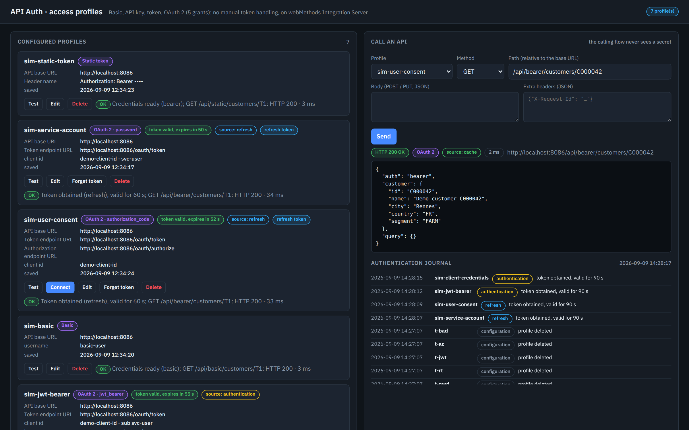
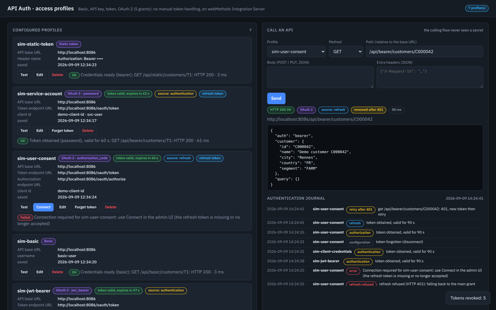
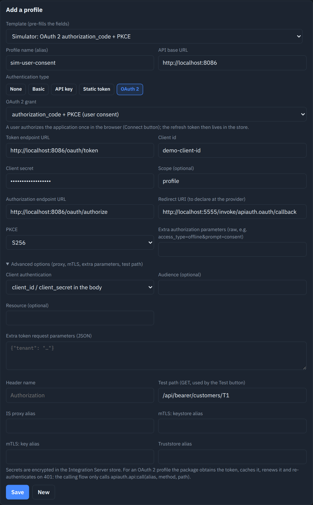
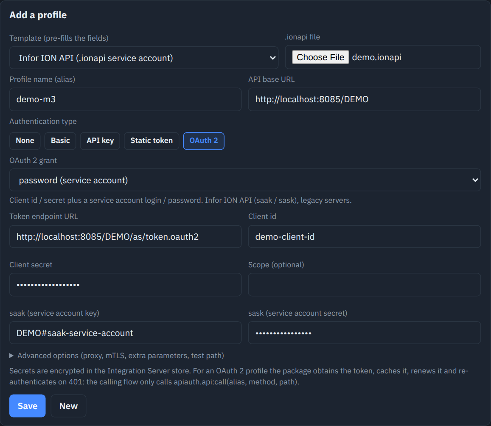
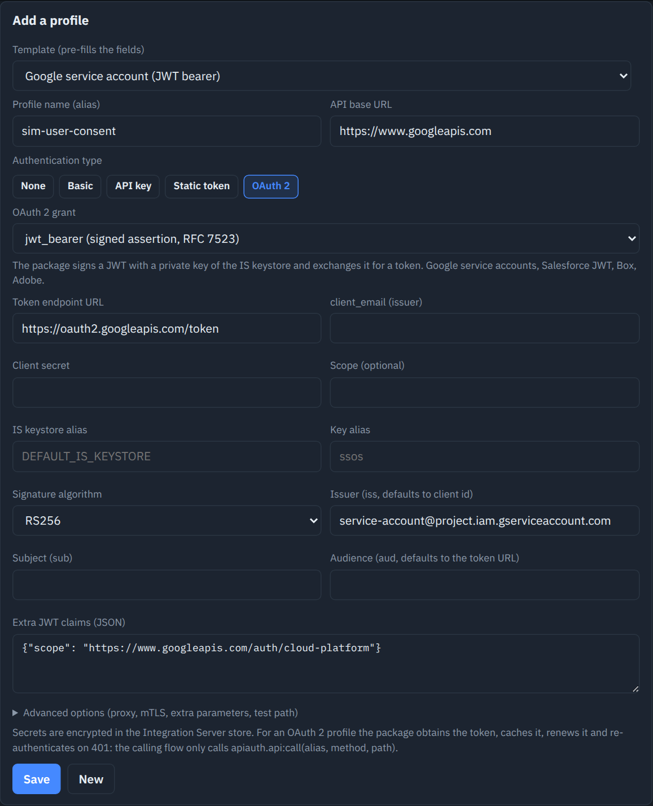
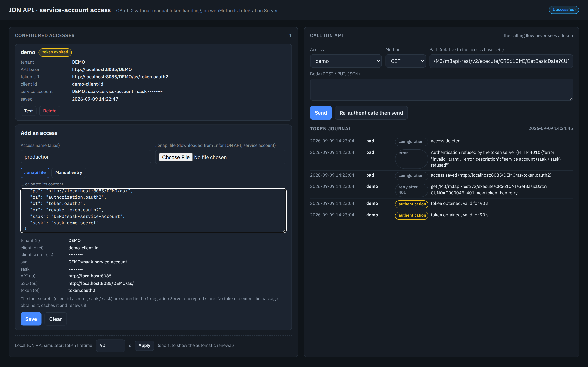
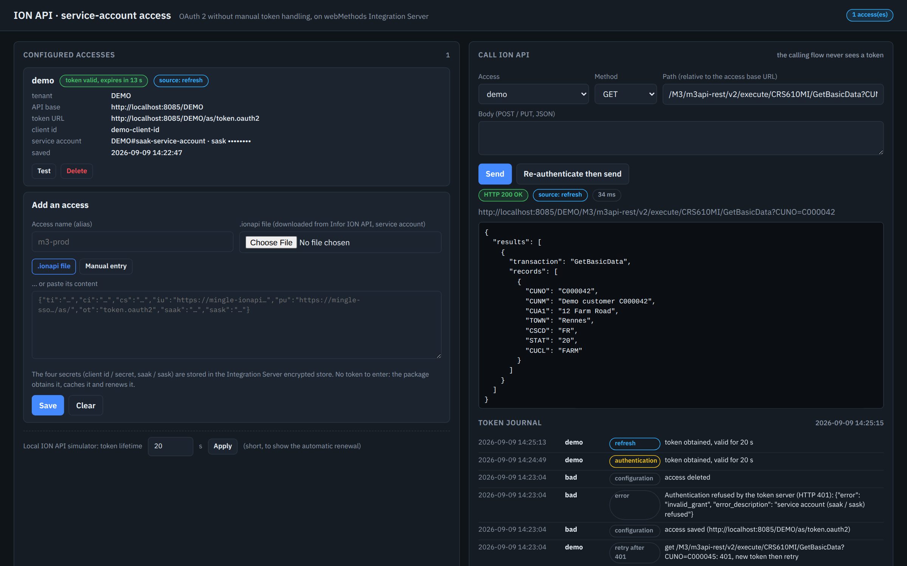

# API authentication without manual token handling, on webMethods Integration Server

Two Integration Server 12.1 packages, built as flow services (putNode through the wm-mcp-server MCP server), that
answer a classic complaint: "to call an API, you have to configure the token, the refresh token, the expiry... by
hand". Here you describe **one access profile** (which mechanism, which credentials), the secrets go into the
encrypted IS store, and the business flow calls a single service: `apiauth.api:call(alias, method, path, body?)`.
The package obtains the token, caches it, renews it before expiry, re-authenticates and retries once after a 401,
and journals every event.

| Package | Scope | UI | Doc |
|---|---|---|---|
| **ApiAuth** | universal: none, Basic, API key (header or parameter), static token, OAuth 2 with the `client_credentials`, `password`, `refresh_token`, `authorization_code` + PKCE (Connect button) and `jwt_bearer` grants signed by the IS keystore; proxy, mTLS, provider templates | `http://localhost:5555/ApiAuth/index.html` | `docs/apiauth.md` |
| **IonApiClient** | original version, specialized for Infor ION API (service account, drop of the `.ionapi` file or manual entry); superseded by the "Infor ION API" template of ApiAuth | `http://localhost:5555/IonApiClient/index.html` | `docs/ionapi-client.md` |

Both UIs are bilingual (`?lang=fr`).

## Screenshots

Configured profiles (one per mechanism), live token state, API call and journal:



Token revoked on the server side: renewal through the refresh token and transparent retry after the 401:



Authorization code: consent window (simulator) opened by the Connect button, and form with PKCE and advanced options:




Infor ION API template (drop of the .ionapi file) and Google service account (JWT bearer signed by the IS keystore):





Original IonApiClient package: home and automatic renewal of an expired token:





## Installing the packages with wpm (no agent, no MCP server)

Each package as deployed lives in its own repository, in the layout expected by wpm (webMethods Package Manager) and
the webMethods Package Registry (`manifest.v3` at the root, tag `v1.0.0`):

```bash
wpm install -r https://github.com/cpoder ApiAuth          # universal package
wpm install -r https://github.com/cpoder IonApiClient     # Infor ION API only (superseded by ApiAuth)
```

Without wpm: clone https://github.com/cpoder/ApiAuth or https://github.com/cpoder/IonApiClient into
`IntegrationServer/instances/default/packages/<Name>` (or zip the content and use Packages > Management > Install
Inbound Releases), then activate the package. No dependency beyond WmPublic; profiles are created from the admin UI
and stored in the IS outbound password store, not in the package.

Verified on IS 12.1: git clone of the tag into `packages/`, reload (17 and 11 nodes, 0 error), both test suites
`TESTS OK` against the installed packages, admin UIs checked in Chromium.

## Getting started

Prerequisites: an Integration Server 12.1 reachable on `localhost:5555` (`Administrator` / `manage`), Python 3,
the wm-mcp-server binary (`WM_MCP_BIN`, or `.mcp.json` from `.mcp.json.example`), `keytool` to export the
certificate of the IS key used by the simulator (`jwt_bearer` grant).

```bash
export IS_HOME=/path/to/IntegrationServer/instances/default     # default: /home/cpo/wm12/...
export WM_MCP_BIN=/path/to/wm-mcp-server
./deploy.sh            # ApiAuth: starts mock/auth_mock.py (port 8086), deploys, tests ("TESTS OK"), publishes the UI
./deploy.sh ionapi     # IonApiClient: mock/ion_mock.py (port 8085), deployment, tests, UI
```

In the ApiAuth UI, the "Template" menu offers nine ready-to-use profiles against the simulator (one per mechanism):
Save, Test, then Send a call. The simulator lets you shorten the token lifetime and revoke tokens to show the silent
renewal and the retry after 401.

## Contents

```
wm/apiauth_build.py     ApiAuth package (17 flows) + end-to-end test suite
wm/ionapi_build.py      IonApiClient package (11 flows) + tests
wm/putnode_builder.py   small flow service builder for the putNode API
wm/mcpcli.py            stdio JSON-RPC client of the wm-mcp-server MCP server
mock/auth_mock.py       OAuth 2 authorization server (5 grants, PKCE, consent) + protected APIs (Bearer, Basic, key, static)
mock/ion_mock.py        ION API simulator (password grant + refresh, fake M3 API)
ui/apiauth, ui/ionapi   admin UIs
docs/                   documentation of both packages, demo .ionapi file
```

## What the tests check

Five profile types, five grants, expiry then silent renewal, server-side revocation then transparent retry,
refresh token rotation, end-to-end authorization code + PKCE (URL, consent, return to the IS), JWT assertion
signed by the IS key and verified by the simulator, readable errors, incomplete profile refused, profile edit
without retyping the secret, and no secret in the service outputs.
